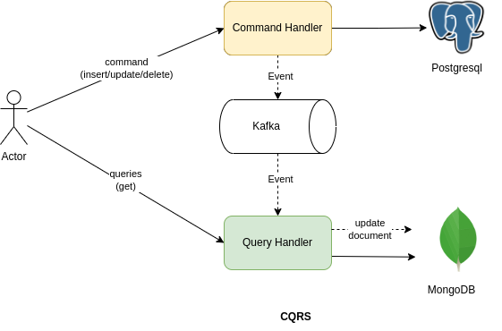
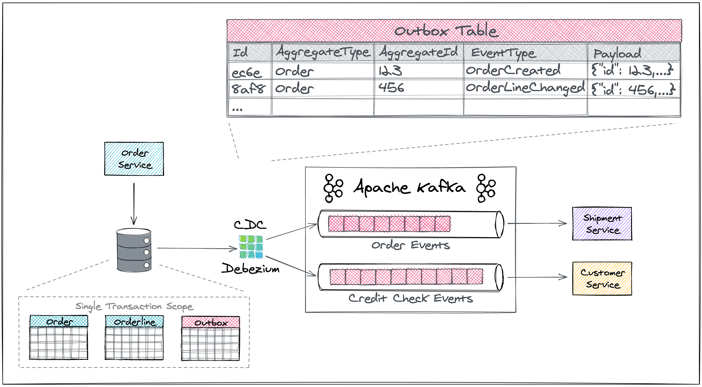

| Service                    | Health-check url             | grpc-endpoint         |
|----------------------------|------------------------------|-----------------------|
| forum-service              | http://localhost:8085/health | http://localhost:9090 |
| notification-service       | http://localhost:8086/health |                       |
| payment-service            | http://localhost:8087/health |                       |
| saga-orchestration-service | http://localhost:8088/health |                       |
| gateway-service            | http://localhost:8080/health |                       |

- Mongo-express: http://localhost:8091/
- Jaeger: http://localhost:16686/search


## I. Architecture

> This project is demo project for what I have learned through my experience as a developer.

With the idea of creating `a forum for English` learners (or learners of any language), we aim to assist users in posting questions online and `earning small rewards`. By leveraging the vast community of learners, we hope to make the journey of learning English or another language significantly easier.

 
#### 1. Overview structure


In our distributed

There are many service that single single service have their own database. Services communicate through `Kafka` to produce command or event. With query request, it is suitable for using `grpc` request directly to service

- **Gateway-sevice**: Receive HTTP request (query/command) forward command to purposed service or combine resource to reponse to client
- **Saga-orchestration-service**: Implement saga-pattern
- **Notification-service**: Implement logic follow and notification
- **Payment-service**: Handle feature reward transaction.
- **Forum-service**: Handle posting and searching post.
- **Media-service**: Upload image to bucket
- **Account-service**: Implement authen/author

#### 2. Pattern

##### A. CQRS

> As our application is a forum so that we'll facing a significantly higher volume of read requests compared to write requests. To address this problem, we 've implemented the CQRS. (See `forum-service` as the implemented one)

- `Command Side`: Handles writes operation (e.g. creatng, updating, deleting)
- `Query Side`: Handles read operations. Queries  are designed to be fast and efficent by flatting the data to embedded document



##### B. Outbox event router

> Consistent is important feature in microservice project. Outbox pattern is shining in here and have take a advantage of transaction in relational database (`postgres`) and Debezium as a Capture Data Change to push message to `Kafka`.




> To apply for almost every service that want produce event as a single transaction with logic.

##### C. Event Sourcing

> Event Sourcing is a great way to track changes in a domain over time. In distributed-english, it can be used to implement rewards.

*It is about `Money` - `Payment-service`.*

| aggregate_type | event_type           | data    | metadata | version | timestamp               |
|----------------|----------------------|---------|----------|---------|-------------------------|
| emoney         | ACCOUNT_INITIALIZED  | 0.0     |          | 1       | 2024‑08‑25 17:45:30.005 |
| emoney         | BALANCE_DEPOSITED    | 25000.0 |          | 2       | 2024‑08‑26 20:45:30.005 |
| emoney         | BALANCE_WITHDREW     | 10000.0 |          | 3       | 2024‑08‑27 08:26:28.005 |
| emoney         | EARNED_REWARD        | 80000.0 |          | 4       | 2024‑08‑28 17:45:30.005 |
| emoney         | OFFERED_REWARD       | 35000.0 |          | 5       | 2024‑08‑28 18:45:30.005 |

=> `current_emoney = 0.0 + 25000.0 - 10000.0 + 80000.0 - 35000.0 = 60000.0`


## II. Opentelemetry

- We are using Java agent to reduce config work. Reference: [opentelemetry-javaagent](https://github.com/open-telemetry/opentelemetry-java-instrumentation)
- And Jaeger as center observation.

## III. TODO

 > Check in [project-issue](https://github.com/linhcongchua/distributed-english/issues)

## IV. How to run

#### Configuration

1. Config `opentelemetry-javaagent.jar` java argument for tracing

```
-javaagent:/path/to/opentelemetry-javaagent.jar
-Dotel.service.name=forum-service
-Dotel.traces.exporter=otlp
-Dotel.exporter.otlp.traces.endpoint=http://localhost:4317
-Dotel.metrics.exporter=none
-Dotel.logs.exporter=none
```

2. Config debezium connector

+ get ip: `ip -o route get to 8.8.8.8 | sed -n 's/.*src \([0-9.]\+\).*/\1/p'`

_replace hostname by ip above_
```shell
curl --location 'http://localhost:8083/connectors' \
--header 'Accept: application/json' \
--header 'Content-Type: application/json' \
--data '{
   "name": "forum-post-connector",
   "config": {
        "connector.class": "io.debezium.connector.postgresql.PostgresConnector",
        "database.hostname": "00.00.00.00",
        "database.port": "5445",
        "database.user": "postgres",
        "database.password": "admin",
        "database.dbname": "forum-service",
        "table.include.list": "public.event_publish",
        "topic.prefix": "holy",
        "transforms" : "outbox",
        "value.converter.schemas.enable": "false",
        "value.converter": "org.apache.kafka.connect.json.JsonConverter",
        "transforms.outbox.table.expand.json.payload": "true",
        "transforms.outbox.type" : "io.debezium.transforms.outbox.EventRouter",
        "transforms.outbox.table.field.event.key": "aggregate_id",
        "transforms.outbox.route.by.field": "aggregate_type",
        "transforms.outbox.route.topic.replacement": "${routedByValue}",
        "transforms.outbox.table.fields.additional.placement": "type:header:EXTRA_HEADER,tracing:header:TRACING"
    }
}'
```
#### API testing

1. creating post

```
curl --location 'http://localhost:8080/api/v1/post' \
--header 'Content-Type: application/json' \
--data '{
    "postTitle": "test-title",
    "postDetail": "test-detail",
    "userId": "a7fef025-0d36-4f3e-9a30-4748a52079e7",
    "reward": 1
}'
```

2. getting post
```
curl --location 'http://localhost:8080/api/v1/post/6773f9a8-3a60-4e53-8344-f29d106b279f'
```