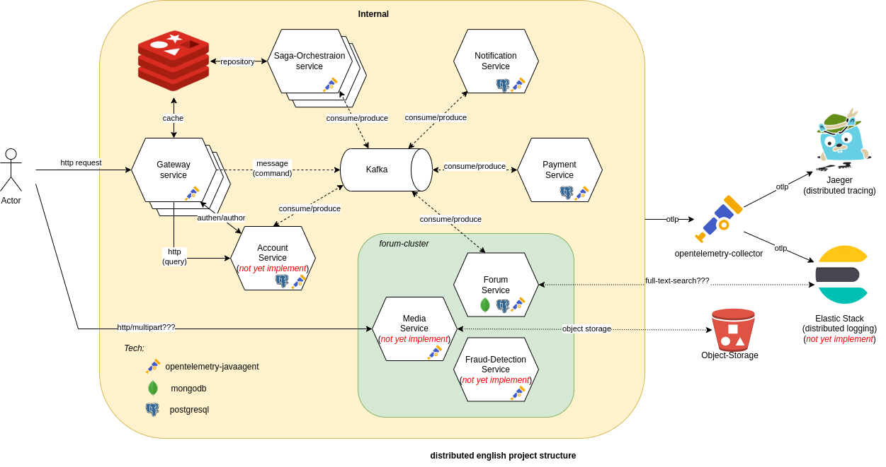

| Service                    | Health-check url             |
|----------------------------|------------------------------|
| forum-service              | http://localhost:8085/health |
| notification-service       | http://localhost:8086/health |
| payment-service            | http://localhost:8087/health |
| saga-orchestration-service | http://localhost:8088/health |

## Architecture

> This project is demo project for what I have learned through those time as a copy/paster

 With an idea `making a forum for English learner or any languages`, that forum can help learner post a question in the internet with a small `reward`, and take advantage of million learner out there. Hope it can make a journey to English or any other languages much easier.

 
#### 1. Overview structure

There are many service that single single service have their own database. Services communicate through `Kafka` to produce command or event. With query request, it is suitable for using `http` request directly to service

- Gateway-sevice: 
- Saga-orchestration-service:
- Notification-service
- Payment-service:
- Forum-service:
- Media-service
- Fraud-detection-service:
- Account-service:

#### 2. Pattern

##### A. CQRS

> As our forum will have more read request than a write. So it can using CQRS for reduce the latance in read request

##### B. Outbox event router

> Consistent is important feature in microservice project. Outbox pattern is shining in here and have take a advantage of transaction in relational database (`postgres`) and Debezium as a Capture Data Change to push message to `Kafka`.

## Opentelemetry

- We are using Java agent to reduce config work. Reference: [opentelemetry-javaagent](https://github.com/open-telemetry/opentelemetry-java-instrumentation)
- And Jaeger as center observation.

## TODO
Move run -> docker & k8s