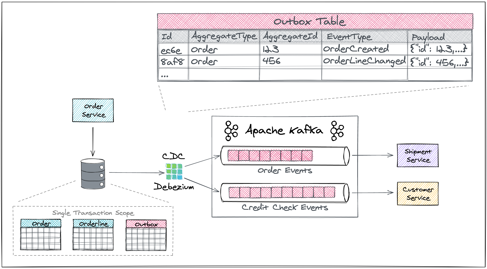

# Outbox Pattern

The overall solution looks like so:



Reference: [debezium-outbox-event-router](https://debezium.io/documentation/reference/stable/transformations/outbox-event-router.html)

Example config debezium connector:
```json
{
    "connector.class": "io.debezium.connector.postgresql.PostgresConnector",
    "tasks.max": "1",
    "database.hostname": "order-db",
    "database.port": "5432",
    "database.user": "postgresuser",
    "database.password": "postgrespw",
    "database.dbname" : "orderdb",
    "topic.prefix": "dbserver1",
    "schema.include.list": "inventory",
    "table.include.list" : "inventory.outboxevent",
    "tombstones.on.delete" : "false",
    "transforms" : "outbox",
    "transforms.outbox.type" : "io.debezium.transforms.outbox.EventRouter",
    "transforms.outbox.route.topic.replacement" : "${routedByValue}.events",
    "transforms.outbox.table.fields.additional.placement" : "type:header:eventType"
}
```

- Config detail view in `debezium-outbox-event-router` above